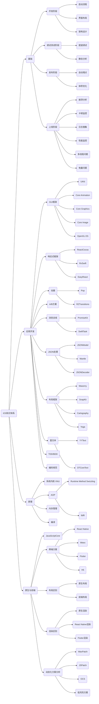

``` mermaid
graph LR
iOS(iOS知识体系)-->Base(基础)
iOS-->App(应用开发)
iOS-->Principle(原理)
iOS-->NativeAndWeb(原生与前端)

%%基础
Base-->Base_Code(开发阶段)
Base-->Base_Test(调试测试阶段)
Base-->Base_Release(发布阶段)
Base-->Base_Online(上线阶段)

Base_Code-->Base_Code0(启动流程)
Base_Code-->Base_Code1(界面布局)
Base_Code-->Base_Code2(架构设计)

Base_Test-->Base_Test0(提速调试)
Base_Test-->Base_Test1(静态分析)

Base_Release-->Base_Release0(自动埋点)
Base_Release-->Base_Release1(体积优化)

Base_Online-->Base_Online0(崩溃分析)
Base_Online-->Base_Online1(卡顿监控)
Base_Online-->Base_Online2(日志搜集)
Base_Online-->Base_Online3(性能监控)
Base_Online-->Base_Online4(多线程问题)
Base_Online-->Base_Online5(电量问题)

%%应用开发
App-->App0(GUI框架)
App0-->App0_0(UIKit)
App0-->App0_1(Core Animation)
App0-->App0_2(Core Graphics)
App0-->App0_3(Core Image)
App0-->App0_4(OpenGL ES)

App-->App1(响应式框架)
App1-->App1_0(ReactCocoa)
App1-->App1_1(RxSwift)
App1-->App1_2(EasyReact)

App-->App2(动画)
App2-->App2_0(Pop)
App2-->App2_1(RZTransitions)

App-->App3(A/B方案)

App-->App4(消息总线)
App4-->App4_0(PromiseKit)
App4-->App4_1(SwiftTask)

App-->App5(JSON处理)
App5-->App5_0(JSONModel)
App5-->App5_1(Mantle)
App5-->App5_2(JSONDecoder)

App-->App6(布局框架)
App6-->App6_0(Masonry)
App6-->App6_1(SnapKit)
App6-->App6_2(Cartography)
App6-->App6_3(Yoga)

App-->App7(富文本)
App7-->App7_0(YYText)
App7-->App7_1(DTCoreText)

App-->App8(TDD/BDD)

App-->App9(编码规范)

%%原理
Principle-->Principle0(系统内核 XNU)

Principle-->Principle1(AOP)
Principle1-->Principle1_0(Runtime Method Swizzling)
Principle1-->Principle1_1(libffi)

Principle-->Principle2(内存管理)

Principle-->Principle3(编译)

%%原生与前端
NativeAndWeb-->NativeAndWeb0(JavaScriptCore)

NativeAndWeb-->NativeAndWeb1(跨端方案)
NativeAndWeb1-->NativeAndWeb1_0(React Native)
NativeAndWeb1-->NativeAndWeb1_1(Weex)
NativeAndWeb1-->NativeAndWeb1_2(Flutter)
NativeAndWeb1-->NativeAndWeb1_3(H5)

NativeAndWeb-->NativeAndWeb2(布局区别)
NativeAndWeb2-->NativeAndWeb2_0(原生布局)
NativeAndWeb2-->NativeAndWeb2_1(前端布局)

NativeAndWeb-->NativeAndWeb3(渲染区别)
NativeAndWeb3-->NativeAndWeb3_0(原生渲染)
NativeAndWeb3-->NativeAndWeb3_1(React Native渲染)
NativeAndWeb3-->NativeAndWeb3_2(Flutter渲染)

NativeAndWeb-->NativeAndWeb4(动态化方案分析)
NativeAndWeb4-->NativeAndWeb4_0(WaxPatch)
NativeAndWeb4-->NativeAndWeb4_1(JSPatch)
NativeAndWeb4-->NativeAndWeb4_2(OCS)
NativeAndWeb4-->NativeAndWeb4_3(低风险方案)
```

.png)